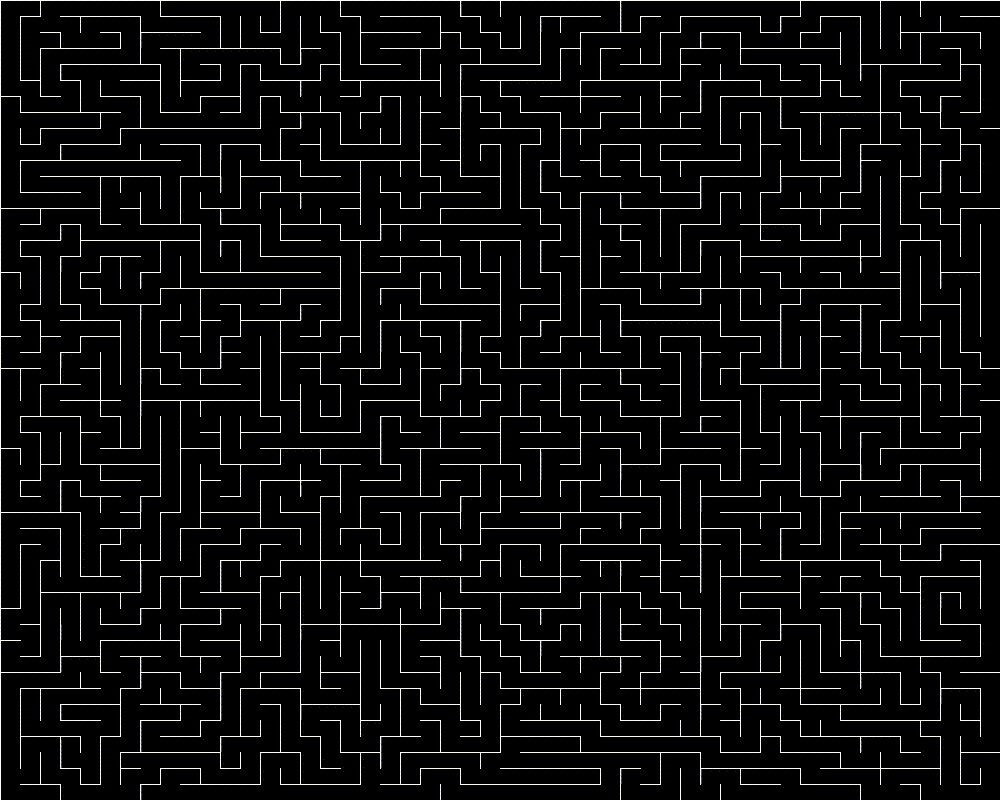

# Maze

The goal of this project is to generate a maze and solve it using algorithms like A*.

## Objectives :
- Learn how to use Pygame;
- Implement a maze generator;
- Implement a path finding algorithm (A*).

## Maze generator 

In order to generate mazes, I used a backtracking algorithm ([ref.](https://en.wikipedia.org/wiki/Maze_generation_algorithm)).

The algorithm starts by creating a grid. 
Each cell has four walls (right, left, top and bottom).
The algorithm stops running when every cell has been visited.
It selects a random cell to be the current one. We then mark it as 'visited' and put this cell on a stack.
After that, it goes through the maze by selecting the next cell from one of the neighboring cells that hasn’t been visited yet .
It opens the wall connecting the two cells, and marks the next cell as the current one after putting it on the stack.

If the current cell has no unvisited neighbors, the current cell is set as the cell at the top of the stack.
This is the backtracking part of the algorithm.

Animation of the generation :

## Maze solver

In this section, we will see different algorithms to solve the maze we generated earlier.

### Algorithm A*

The algorithm we use to solve the maze is A* [ref.](https://en.wikipedia.org/wiki/A*_search_algorithm), it's a heuristic based algorithm. A heuristic is a function that help us determine which cell we should visit.

For this algorithm, the heuristic used will be the distance of the current cell from the exit of the maze.
We also determine the notion of cost. The cost of moving from one cell to another is 1; the cost of being in the first cell is 0.

A* begins by initializing two queues, "open" and "close" which store cells of the maze. "open" is a priority queue meaning that elements are stored and sorted based on the value of the cost to which we add the heuristic. Sorting the "open" queue allows us to visit the best candidate first.

The algorithm takes an entry cell and put it in the "open" queue.

While the "open" queue is not empty or the first element is not the exit, we select the first element of the queue which will be the current cell.

Then, for every neighbor of the current cell, we check if they are not already present in the "close" queue or if they are present in the "open" queue with a better cost. If not, we add those neighbors to the "open" queue. Once every neighbor are checked, we remove the current cell from "open" and add it to "close".

Animation of the A* algorithm :

(In blue you can see the cell in 'open' and in red the current cell.)

